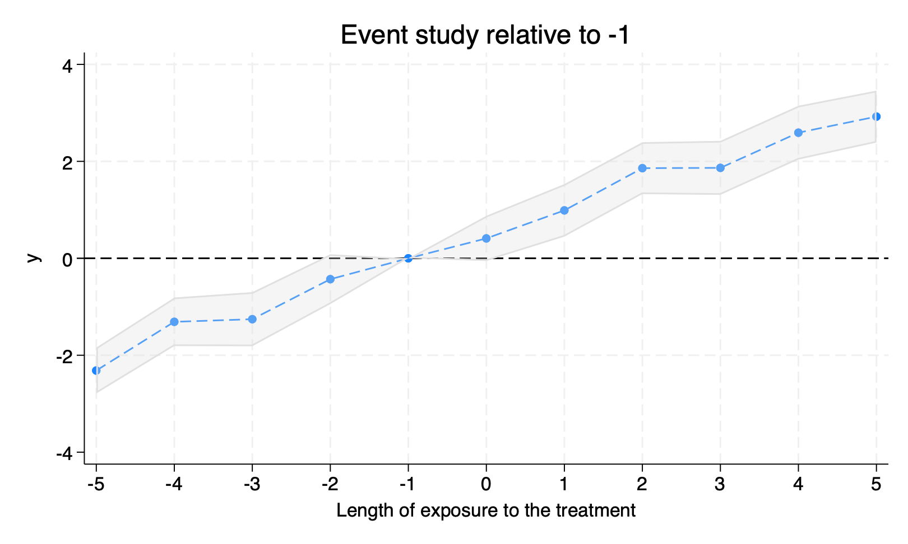

# `eventbaseline` Correct event study after `xthdidregress`

# Syntax

- `eventbaseline`, [**pre**(#) **post**(#) **baseline**(*string*) **generate**(*name*)]

`eventbaseline` transforms the coefficients estimated by `xthdidregress` into a correct event study relative to a baseline. The reported coefficients are the average treatment effects on the treated (ATT) for each period relative to the baseline. The baseline can be either a period before the treatment or the average of the pre-treatment periods.


The package can be installed with
```
net install eventstudy, from(https://raw.githubusercontent.com/codedthinking/eventstudy/main/)
```

# Options
## Options
Option | Description
-------|------------
**pre** | Number of periods before treatment to include in the estimation (default 1)
**post** | Number of periods after treatment to include in the estimation (default 3)
**baseline** | Either a negative number between `-pre` and `-1` or `average`, or `atet`. If `-k`, the baseline is the kth period before the treatment. If `average`, the baseline is the average of the pre-treatment periods. If `atet`, the regression table reports the average of the post-treatment periods minus the average of the pre-treatment periods. Default is `-1`.
**generate** (optional) | Name of the frame to store the coefficients and their confidence interval.

# Background
`xthdidregress` returns ATET between `t` and `t-1` whenever `t` is before the treatment. That is, pretrends are reported as first differences, whereas actual treatment effects are reported as difference relative to the period before treatment. This can lead to misleading event study plots (Roth 2024a). The `eventbaseline` command transforms the coefficients into a correct event study relative to a baseline.

# Remarks
The command can only be run after `xthdidregress`. 

The command also returns, as part of `e()`, the coefficients and standard errors. See `ereturn list` after running the command. Typical post-estimation commands can be used, such as `outreg2` or `estout`.

The reported number of observations is also corrected to exclude the treated periods outside the reported event window.

If the `generate` option is used, the returned frame contains the following variables:
- `time`: the time period relative to the baseline
- `coef`: the estimated coefficient
- `lower`: the lower bound of the 95% confidence interval
- `upper`: the upper bound of the 95% confidence interval

The frame is `tsset` by `time`, so `tsline` can be used to plot the event study.

# Examples
See `example.do` and `example.log` for a full example.

```
. use "df.dta"
. replace t = t + 100
. xtset i t
. xthdidregress ra (y) (d), group(i)
note: variable _did_cohort, containing cohort indicators formed by treatment
      variable d and group variable i, was added to the dataset.

<output omitted>

. eventbaseline, pre(5) post(5) baseline(-1) generate(eventstudy_correct)

Time variable: time, -5 to 5
        Delta: 1 unit

Event study relative to -1               Number of obs = 1,850

------------------------------------------------------------------------------
           y |       ATET   Std. err.      z    P>|z|     [95% conf. interval]
-------------+----------------------------------------------------------------
          -5 |   -2.31541   .2415591    -9.59   0.000    -2.788857   -1.841963
          -4 |  -1.310102   .2551332    -5.13   0.000    -1.810153   -.8100498
          -3 |  -1.256003    .284372    -4.42   0.000    -1.813362   -.6986446
          -2 |  -.4307123   .2619239    -1.64   0.100    -.9440736     .082649
          -1 |          0  (omitted)
           0 |   .4105212   .2379038     1.73   0.084    -.0557617    .8768041
           1 |   .9888228   .2764365     3.58   0.000     .4470172    1.530629
           2 |   1.859271   .2727555     6.82   0.000      1.32468    2.393862
           3 |   1.865648   .2840544     6.57   0.000     1.308911    2.422384
           4 |   2.591579   .2831633     9.15   0.000     2.036589    3.146569
           5 |   2.923434   .2730864    10.71   0.000     2.388195    3.458674
------------------------------------------------------------------------------

. frame eventstudy_correct: tsline upper coef lower
```




```
. xthdidregress ra (y) (d), group(i)
note: variable _did_cohort, containing cohort indicators formed by treatment
      variable d and group variable i, was added to the dataset.

<output omitted>

. eventbaseline, pre(5) post(5) baseline(atet)

Event study relative to atet             Number of obs = 1,850

------------------------------------------------------------------------------
           y |       ATET   Std. err.      z    P>|z|     [95% conf. interval]
-------------+----------------------------------------------------------------
        ATET |   2.835658   .1134013    25.01   0.000     2.613396     3.05792
------------------------------------------------------------------------------
```


# Authors
- Miklós Koren (Central European University, https://koren.mk), *maintainer*

# License and Citation
You are free to use this package under the terms of its [license](LICENSE). If you use it, please the software package in your work:

- Koren, Miklós. 2024. "EVENTBASELINE: Correct Event Study After XTHDIDREGRESS. [software]" Available at https://github.com/codedthinking/eventstudy.

# References
- Roth, Jonathan. 2024a. "Interpreting Event-Studies from Recent Difference-in-Differences Methods." Available at https://www.jonathandroth.com/assets/files/HetEventStudies.pdf. Last accessed January 23, 2024.
- Roth, Jonathan. 2024b. "Test Data for >Interpreting Event-Studies from Recent Difference-in-Differences Methods< [data set]." Available at https://github.com/jonathandroth/HetEventStudies/raw/master/output/df.dta Last accessed January 23, 2024.